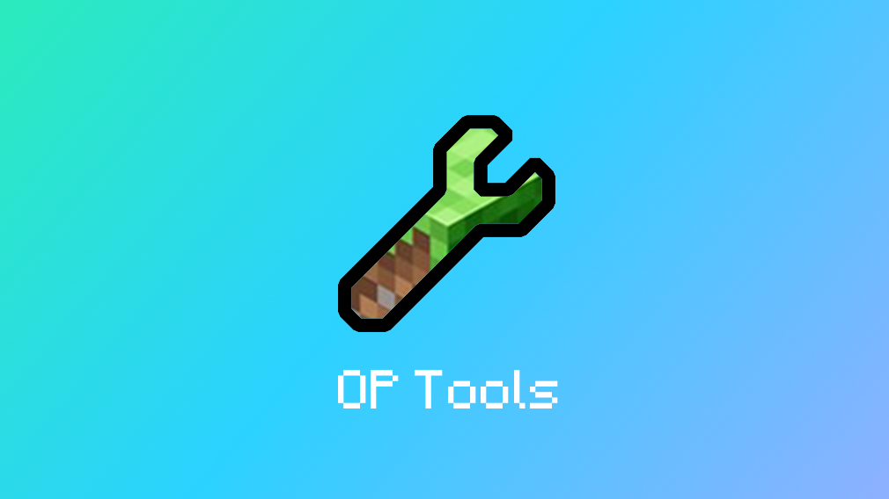

# LSE-OPTools

## 前言

为了确保最佳的使用体验，请仔细阅读文档  
**遇到问题请在[Github Issue](https://github.com/engsr6982/lse-workspace/issues)反馈！**

:::tip
[点我前往MIneBBS OPTools](https://www.minebbs.com/resources/op-tools-op-gui.4836/)  
[点我加入 反馈/聊天群](https://qm.qq.com/cgi-bin/qm/qr?k=jmd_S7-T9UGiVp9eiPyHtuIuEApwVIq5&authKey=6c4npR7mamU4DP72JQKTYQAIz12vhRXHE4/U6GCriqjtiQpaa3Gf6Q+sYricFR9y&noverify=0)
:::

## 功能一览表

| **功能** | **备注** | **内部函数** |
| ---- | --- | -------- |
| 踢出玩家 |  | Kick_Ui |
| 杀死玩家 |  | Kill_Ui |
| 更改天气 |  | Weather_Ui |
| 更改时间 |  | Time_Ui |
| 广播消息 |  | Broad_Ui |
| 设置MOTD |  | Motd_Ui |
| 设置人数 |  | Set_Player_Ui |
| 玩家传送 | 支持**传送玩家\|玩家互传\|传任意坐标** | Tp_Ui |
| 清理掉落物 | 支持**Cleaner** | Clear_Item_Ui |
| 更改游戏模式 |  | setMode_Ui |
| 更改游戏规则 |  | setRule_Ui |
| 获取隐藏方块 |  | getBlock_Ui |
| 执行后台命令 |  | ConsoleCmd_Ui |
| 发消息给玩家 |  | sendPlayer_Ui |
| 崩溃玩家客户端 |  | Crash_Ui |
| 以玩家身份说话 |  | Player_Talk_Ui |
| 玩家身份执行命令 |  | Player_Cmd_Ui |
| Ban GUI | **依赖云黑** | Ban_Ui |
| 发送表单 |  | Forms_Ui |
| 玩家详细信息 |  | Info_Ui |
| 命令黑名单 |  | Black_Cmd_Ui |
| 药水GUI |  | Potion_Ui |

## 命令系统

:::warning
`[]`为**可选参数** | `{}`为**必选参数**  
输入命令时请不要带上`[]`或`{}`
:::

import Tabs from '@theme/Tabs';
import TabItem from '@theme/TabItem';

<Tabs>
  <TabItem value="基础命令" label="🎯基础命令" default>
    `/tools` - 打开GUI

    `/tools gui` - 打开GUI  

    `/tools set` - 打开设置GUI  
  </TabItem>
  <TabItem value="控制台命令" label="🎯控制台命令">
    `/tools add {Name: String}` - 添加插件管理  

    `/tools remove {Name: String}` - 移除插件管理  

    `/tools reload` - 重载配置文件  
  </TabItem>
</Tabs>
