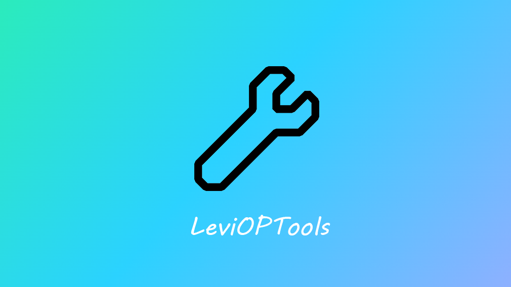

# LeviOPTools

## 前言

有关`LeviOPTools`的任何错误、疑问、Bug、建议，请在[Github Issues](https://github.com/engsr6982/LeviOPTools/issues)中提出。

## 功能一览

import Tabs from "@theme/Tabs";
import TabItem from "@theme/TabItem";

<Tabs>

<TabItem value="命令" label="🎯 命令" default>

| 功能         | 描述                   | 状态 |
| ------------ | ---------------------- | ---- |
| 踢出玩家     | 踢出一个或多个玩家     | √    |
| 杀死玩家     | 强行 Kill 玩家         | √    |
| 广播消息     | 发送广播消息           | √    |
| 设置人数     | 设置服务器人数         | √    |
| 传送功能     | 传送玩家、坐标         | √    |
| 游戏模式     | 设置游戏模式           | √    |
| 崩溃客户端   | 强制崩溃客户端         | √    |
| 玩家身份说话 | 使用某个的玩家身份说话 | √    |
| 重载配置文件 | 重载插件的配置文件     | √    |

</TabItem>

<TabItem value="GUI" label="📲 GUI">

| 功能             | 描述                       | 状态   |
| ---------------- | -------------------------- | ------ |
| 自定义主页       | 自定义主页（仿菜单）       | √      |
| 踢出玩家         | 批量踢出玩家               | √      |
| 杀死玩家         | 批量 Kill 玩家             | √      |
| 更改时间         | 自定义服务器时间           | √      |
| 更改天气         | 自定义服务器天气           | √      |
| 广播消息         | 发送广播消息               | √      |
| Motd 管理        | 混动 Motd                  | √      |
| 传送功能         | 传送玩家、坐标             | 开发中 |
| 清理掉落物       | 清理掉落物                 | 开发中 |
| 游戏模式         | 设置游戏模式               | 开发中 |
| 游戏规则         | 快捷的修改游戏规则         | √      |
| 获取方块或物品   | 快速获取隐藏的方块或物品   | √      |
| 模拟控制台       | 在游戏中模拟控制台         | √      |
| 发消息给玩家     | 发送消息（成就）给玩家     | 开发中 |
| 崩溃客户端       | 批量崩溃玩家客户端         | √      |
| 玩家身份说话     | 使用某个的玩家身份说话     | √      |
| 玩家身份执行命令 | 使用某个的玩家身份执行命令 | √      |
| BanGUI           | 为黑名单插件提供 GUI       | 开发中 |
| 玩家详细信息     | 查看玩家详细信息           | 开发中 |
| 命令黑名单       | 管理命令黑名单             | 开发中 |
| 药水 GUI         | 快捷的添加药水效果         | 开发中 |

</TabItem>

<TabItem value="Other" label="🧰 其他">

| 功能       | 描述                       | 状态   |
| ---------- | -------------------------- | ------ |
| Nbt 编辑器 | 编辑物品 Nbt               | 开发中 |
| 生存飞行   | 让玩家在游戏中飞行         | 开发中 |
| 区块操作   | 备份、恢复 区块            | √      |
| 结构操作   | 加载、放置、导出结构文件   | √      |
| 选区操作   | 复制、旋转、镜像、导出选区 | √      |

</TabItem>

</Tabs>
