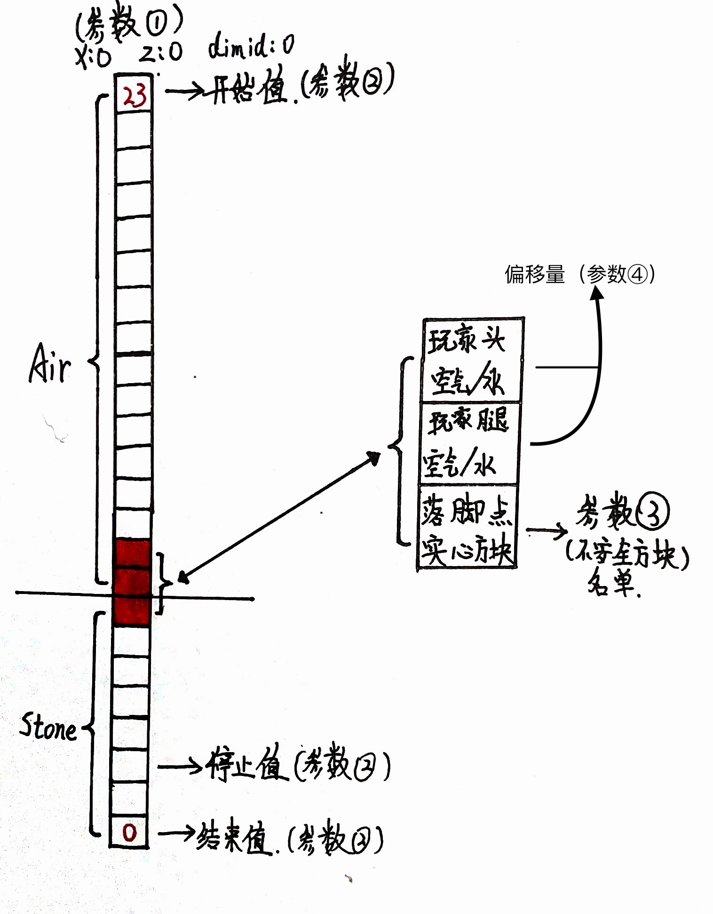

# 查找坐标

`findPos`
根据x,z,dimid查找安全坐标

- 参数:
  - position: `object`  
    坐标
  - findParameters: `object`  
    查找参数
  - dangerousBlocks: `array`  
    不安全方块
  - deviation: `object`  
    偏移量
- 返回值: `object`
- 抛出: 区块未加载/C++异常

- 参数详解:

```js title="position"
{
    x: 0, // 要查找的坐标
    z: 0,
    dimid: 0
}
```

```js title="findParameters"
{
    startingValue: 301, // 遍历开始值
    endValue: 0, // 遍历结束值
    stopValue: 10 // 遍历停止值（遍历会在这个值提前结束）
},
```

```js title="dangerousBlocks"
[
    "minecraft:lava", // 危险方块，填写标准名
    "minecraft:flowing_lava"
], 
```

```js title="deviation"
{
    offset1: 1, // 偏移量 （对应玩家腿部）
    offset2: 2  // 偏移量 （对应玩家头部）
}
```

:::tip

```js title="调用示例"
const fp = ll.imports("ZoneCheckV3", "findPos");
fp({x:0, z:0, dimid:0},{startingValue:301, endValue:0, stopValue:10},["minecraft:lava","minecraft:flowing_lava"],{"offset1":1, "offset2": 2});
```

```js title="返回值"
{
    status: 0 | 1, // 状态（是否查找成功）
    x: int,
    y: int, // 安全坐标
    z: int,
    dimid: int
}
```

:::

:::note
这是原理图(字丑见谅)

:::
